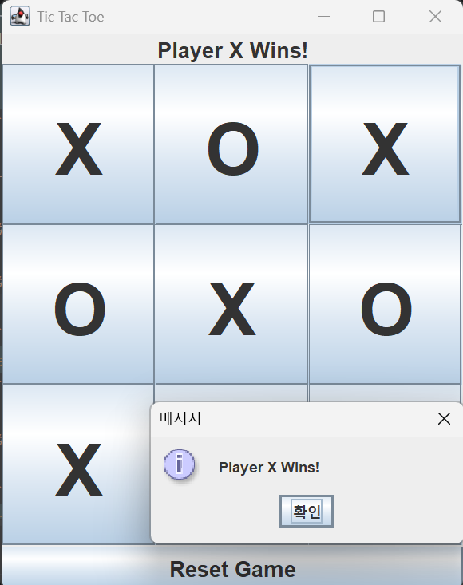

# Tic Tac Toe

Java Swing을 이용하여 제작한 Tic Tac Toe 게임입니다.

## 프로젝트 소개

대학교 자바 프로그래밍 과목 기말 과제를 위해 제작한 GUI 기반 틱택토 게임입니다.
Java Swing 라이브러리를 사용하여 게임 화면을 구성하였으며,
플레이어 턴 변경, 승리 판정, 무승부 판정, 게임 초기화 기능을 구현했습니다.

---

## 개발 환경

* Eclipse Temurin JDK 24
* Java Swing
* IntelliJ IDEA
* Git / GitHub

---

## 주요 기능

* 3x3 틱택토 게임 보드
* X / O 플레이어 턴 변경
* 가로 / 세로 / 대각선 승리 판정
* 무승부 판정
* 게임 종료 후 입력 비활성화
* Reset 버튼을 통한 게임 초기화

---

## 프로젝트 구조

```text
src/
 └─ main/
     └─ java/
         └─ TicTacToe.java
```

---

## 실행 방법

### 컴파일

```bash
javac TicTacToe.java
```

### 실행

```bash
java TicTacToe
```

---

## 구현 화면



---
